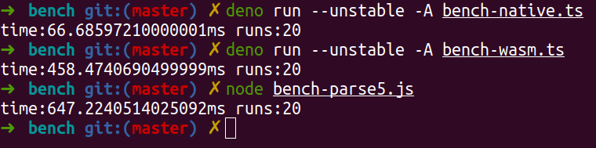

# Benchmarking
There should be benchmarks against Parse5 (from Node.js/JSDOM) and native
deno-dom vs deno-wasm in here... But it's a wreck atm, just ignore for now.

From some premature tests I've discovered that WASM performs a little slower
than Node.js' Parse5 on the first cold run, but as the V8 optimizer gets to
work it gets just as fast or surpasses it consistently... Will need data to back
up that claim though.

Here's a naive benchmark though:

